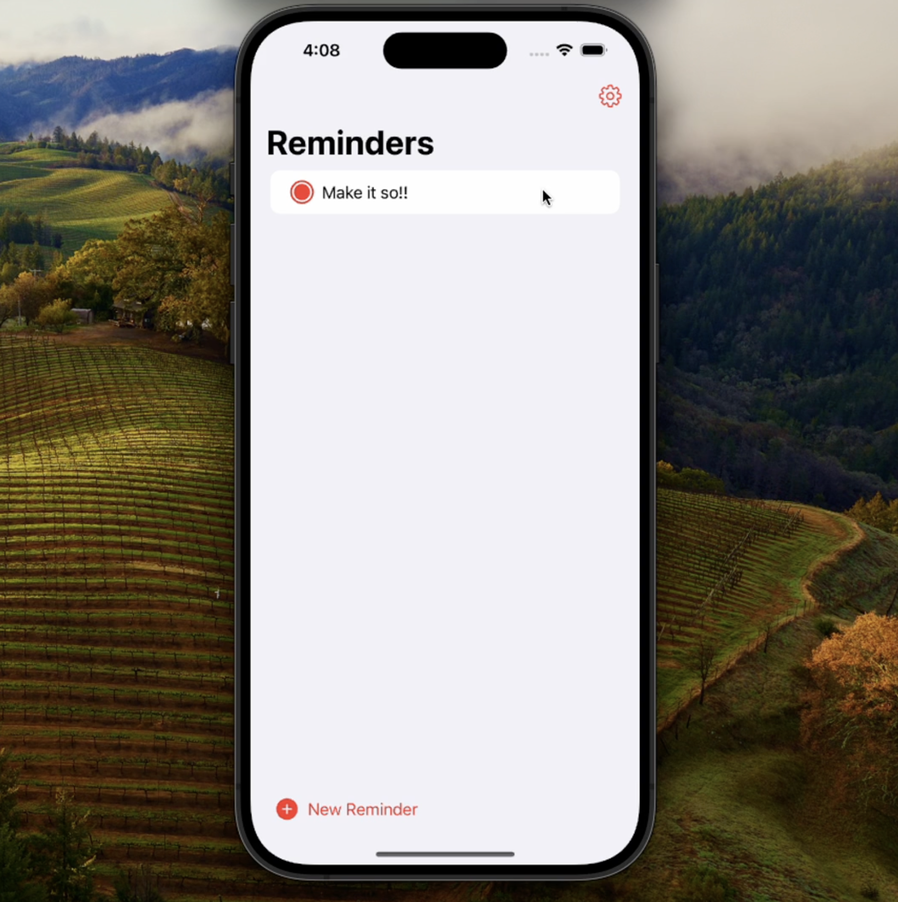

# Make it so - A reminder clone using SwiftUI and firebase

> 🚀 Built following the tutorial by Peter Friese: [link to tutorial](https://peterfriese.github.io/MakeItSo/tutorials/makeitso)

Features:

1. Firebase Authentications
   1. Anonymous
   2. Email/Password
   3. Google
   4. Apple
2. Firebase Cloud Firestore
3. MVVM (Model, View, ViewModel) architecture with Dependency Injection with
4. Uses Factory Design Pattern for Dependencies
5. Uses Combine for syncing data between viewmodels and services

