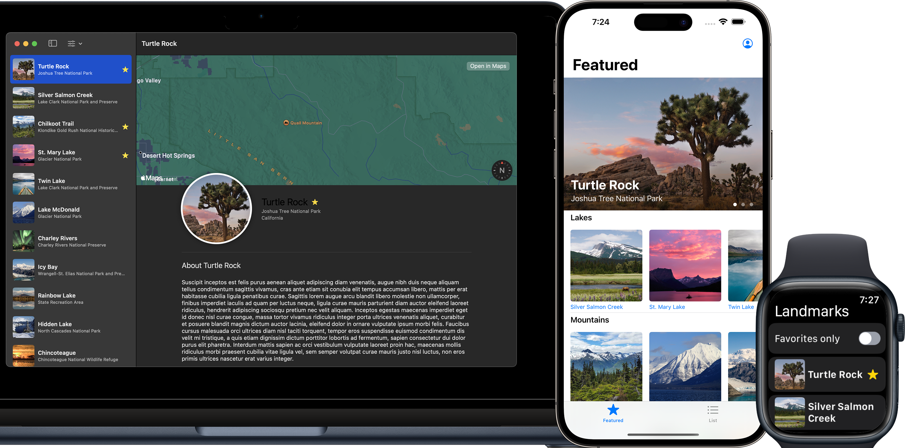

# SwiftUI Tutorial Apps

This repository is a collection of SwiftUI projects built following the [Apple Developer](https://developer.apple.com/tutorials/swiftui) and other tutorials. Each project is a simple app that demonstrates a specific SwiftUI feature or technique. The projects are built to run on iOS, watchOS, and macOS.

## Projects

- [**Landmarks App**](Landmarks/README.md)
